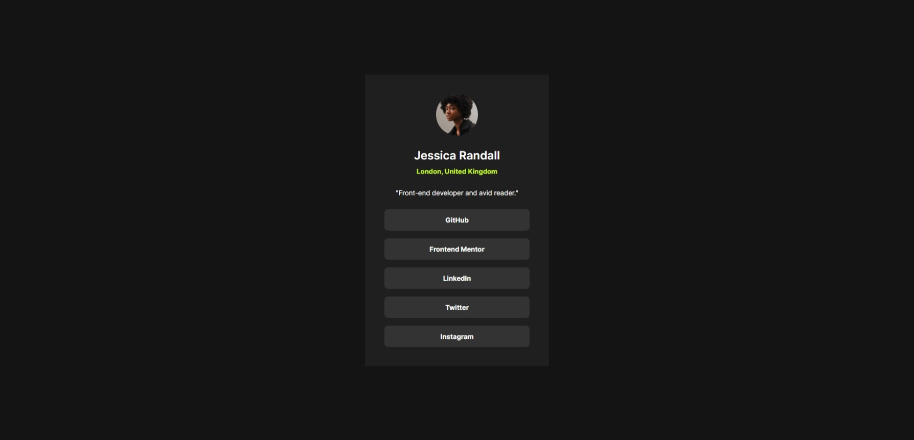

# Frontend Mentor - Social links profile solution

This is my solution to the [Social links profile challenge on Frontend Mentor](https://www.frontendmentor.io/challenges/social-links-profile-UG32l9m6dQ).

## Table of contents

- [Overview](#overview)
  - [The challenge](#the-challenge)
  - [Screenshot](#screenshot)
  - [Links](#links)
- [My process](#my-process)
  - [Built with](#built-with)
  - [What I learned](#what-i-learned)
- [Author](#author)

## Overview

### The challenge

This challenge was an easy one, focused on CSS and HTML only. One thing that was new to me was to change the cursor (which I did).

Also, users should be able to:

- See hover and focus states for all interactive elements on the page

### Screenshot



### Links

- Live Site URL: [Live site URL here](social-links-profile-topaz-ten.vercel.app)

## My process

### Built with

- Semantic HTML5 markup
- CSS custom properties
- Flexbox
- Responsive - Mobile Design

### What I learned

Even though it was an easy challenge, I reviewed concepts I already knew, such as Flexbox and CSS variables. I followed best practices by keeping the code organized and making good use of variables.

However, this challenge had a new thing to me. Change the cursor pointer.

To see how you I did this, see below:

```css
.link:hover,
.link:focus {
  ...
  cursor: url("/assets/handcursor.svg") 6 0, pointer;
}
```
With `cursor: url("/assets/handcursor.svg") 6 0, pointer;`, I can change to cursor to the **handcursor.svg**. If fail, will fallback to **pointer**.

## Author

- Frontend Mentor - [@Vinicius-PR](https://www.frontendmentor.io/profile/Vinicius-PR)
- Linkedin - [@Vinicius](https://www.linkedin.com/in/vinicius-paula-resende/)
